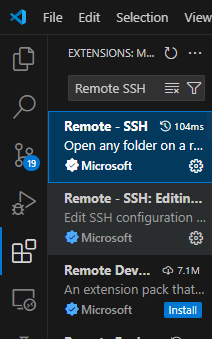
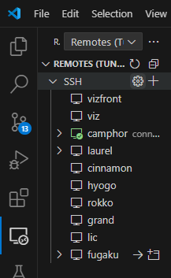
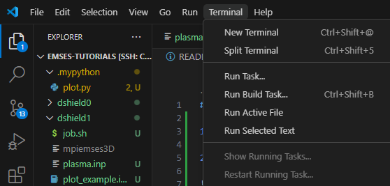
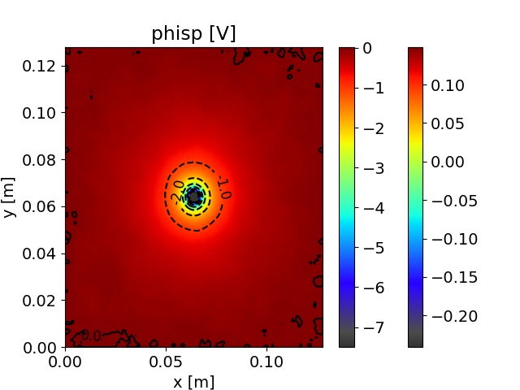
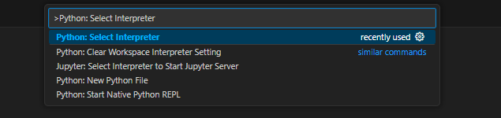

# 初回チュートリアル（EMSES 起動まで）

以下の手順に従って、京大スパコン *camphor* 上で **EMSES** を実行できる状態にしてください。

---

## 1. 開発環境の準備

**目的:** VSCode からリモートでスパコンに接続できるようにする。

- VSCode を起動し、拡張機能 **Remote-SSH** をインストール  
  

- 京大スパコン *camphor* にログイン  
  

- TERMINAL を開く  
  

---

## 2. 環境設定と EMSES の導入

**目的:** データ領域を確保し、依存環境と EMSES をインストール。

```bash
# データ領域の確保
mkdir /LARGE0/gr20001/$USER
ln -s /LARGE0/gr20001/$USER ~/large0

# .bashrc に環境変数を追記
grep -qxF 'module load intel-python' ~/.bashrc || echo 'module load intel-python' >> ~/.bashrc
grep -qxF 'export PATH="$PATH:$HOME/.local/bin"' ~/.bashrc || echo 'export PATH="$PATH:$HOME/.local/bin"' >> ~/.bashrc

exec $SHELL -l

# チュートリアルリポジトリの導入 & EMSES の導入
mkdir ~/large0/Github
cd ~/large0/Github
git clone https://github.com/CS12-Laboratory/EMSES-tutorials.git
cd EMSES-tutorials
pip install -r requirements.txt # include: git+https://github.com/CS12-Laboratory/MPIEMSES3D.git

# VSCode で開く
code --reuse-window ~/large0/Github/EMSES-tutorials
```

<details>
<summary>EMSES (MPIEMSES3D) の導入の詳細</summary>

**For end-user (non-developer)**

今回はこちらでインストールされている (`pip install -r reqquirements.txt` 時)

```bash
pip install git+https://github.com/CS12-Laboratory/MPIEMSES3D.git
```

**For developer**

```
cd ~/large0/Github
git clone https://github.com/CS12-Laboratory/MPIEMSES3D.git
cd MPIEMSES3D
pip install -e . # run make
```

</details>

---

## 3. 実行準備

**目的:** 実行ファイルを配置してジョブを投げられる状態にする。

* 実行ファイルのコピー

```bash
emses-cp dshield0/
emses-cp dshield1/
emses-cp dshield2/
```

* `dshield0` ディレクトリでテスト実行

```bash
cd ~/large0/Github/EMSES-tutorials/dshield0
mysbatch job.sh
```

※ `mysbatch`: plasma.inp の nodes(:) を読み取り、job.sh にプロセス数を設定して `sbatch` を実行するカスタムコマンド（[camptools](https://github.com/Nkzono99/camptools)）。

---

## 4. ジョブの確認と管理

* 実行状況確認

  ```
  qs        # 実行状況
  squeue    # ジョブ一覧
  qgroup    # 計算資源の空き状況
  latestjob # 最新ジョブの log を tail
  ```

* ジョブ削除: `scancel <job-id>`

* 標準出力: `stdout.****.log`

* 標準エラー: `stderr.****.log`

---

## 5. ジョブ終了の確認

* `squeue` に表示がなければ完了
* `stdout/stderr` ログ確認
* 可視化結果確認

---

## 6. 可視化

**方法 1:** `.mypython/plot.py` により PNG/GIF を生成
例: `phisp_2d_xy.png`


**方法 2:** Jupyter Notebook (`dshield0/plot_example.ipynb`)

1. **Python interpreter 設定**

   * venv 利用例:

     ```bash
     cd ~/large0
     /usr/bin/python3.11 -m venv .venv
     # 再インストール
     ~/large0/.venv/bin/python -m pip install -r ~/large0/Github/EMSES-tutorials/requirements.txt
     ~/large0/.venv/bin/python -m pip install -U emout
     ```

     VSCode で `~/large0/.venv/bin/python` を選択
   * もしくは camphor の Intel-Python を指定
     `/opt/system/app/intelpython/2024.2.0/bin/python`

   

2. **参考資料**

   * [emout 可視化ライブラリ](https://github.com/Nkzono99/emout)
   * [サンプルコード](https://nbviewer.org/github/Nkzono99/examples/blob/main/examples/emout/example.ipynb)

---

## 7. シミュレーション拡張

* **実行時間を延長**
  `dshield0/plasma.inp` 内の `nstep=100` → 大きな値へ変更

* **他設定の実行**
  `dshield1` / `dshield2` の `plasma.inp` を確認し、実行比較

* **可視化と考察**
  `dshield0` と同様に出力を確認・議論

---

## 8. 結果の事前予想

* **ds0:** 真空中の負電荷
* **ds1:** 密度 107/cm³・温度 3 eV のプラズマ中
* **ds2:** ds1 の 1/16 の密度

Q1. ds0 の電位分布は？
Q2. ds1 での違いは？
Q3. ds1 で電子・イオンは？
Q4. ds2 での違いは？
Q5. 温度変化の影響は？

---

## 9. 練習課題

* `dshield0～2` を実行・可視化
* 予想と結果を比較し、差異の理由を考察
* **注意:** `ds0` 可視化時は `wp=0.0d0` だと `emout` が動作しないため、`plasma.inp` に `wp=1.0d0` 等を設定

---

## 10. 学習の進め方

* 実行がうまくいかない場合はまず M1 の先輩へ相談

* 先生に質問する際は以下を明記：

  1. 先輩に質問した内容
  2. その回答
  3. 回答に基づき試したこと
  4. 未解決部分

* 最低限確認すべき出力: 電子密度（nd1p）、イオン密度（nd2p）、電位分布（phisp）

* B4 メンバー間で議論し、次回チュートリアルで考察内容を共有

---

## 参考資料

* [京大スパコン利用マニュアル（要認証）](http://web.kudpc.kyoto-u.ac.jp/manual-new/ja)
* [神大スパコン利用マニュアル](http://www.eccse.kobe-u.ac.jp/pi-computer/)
* Miyake & Usui (2009), *Phys. Plasmas*, 16, 062904. [https://doi.org/10.1063/1.3147922](https://doi.org/10.1063/1.3147922)
* 三宅 他 (2019), *混相流*, 33(3), 258–266. [https://doi.org/10.3811/jjmf.2019.T011](https://doi.org/10.3811/jjmf.2019.T011)
* Lapenta, *PIC Methods for Space Weather*, PSC Project.
  [http://fishercat.sr.unh.edu/psc/\_downloads/lapenta.pdf](http://fishercat.sr.unh.edu/psc/_downloads/lapenta.pdf)
* 松本, *pCANS ドキュメント*, 千葉大 CANS プロジェクト.
  [http://www.astro.phys.s.chiba-u.ac.jp/pcans/](http://www.astro.phys.s.chiba-u.ac.jp/pcans/)
* 過去の修論・卒論

```
```
