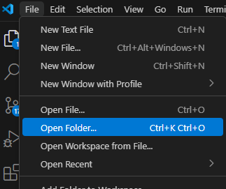
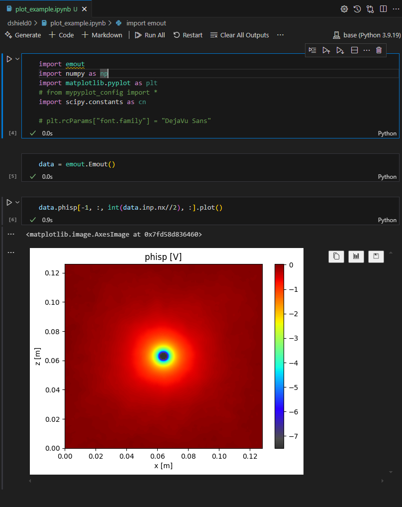

# 初回チュートリアル

以下の手順で、まずは EMSES が動くところまでお試しください。

## 1. vscode を立ち上げ, 拡張機能「Remote-SSH」をインストールする


## 2. 京大のスパコンの camphor にログインする.


## 3. TERMINAL を開く


## 4. データ領域を設定する：LARGE0

```bash
mkdir /LARGE0/gr20001/$USER
ln -s /LARGE0/gr20001/$USER ~/large0
```

## 5. .bashrc に以下を追記し、再起動

```bash
grep -qxF 'module load intel-python' ~/.bashrc || echo 'module load intel-python' >> ~/.bashrc
grep -qxF 'export PATH="$PATH:$HOME/.local/bin"' ~/.bashrc || echo 'export PATH="$PATH:$HOME/.local/bin"' >> ~/.bashrc
```

## 6. 再接続後、"Open Folder"から`~/large0`を選択する => 再度パスワード入力



## 7. 再接続後、TERMINAL を開き、EMSES のインストール

```bash
mkdir ~/large0/Github
cd ~/large0/Github
git clone https://github.com/CS12-Laboratory/MPIEMSES3D.git
cd MPIEMSES3D
make
```

## 8. 本リポジトリをクローンし、必要な python ライブラリをインストールする

```bash
cd ~/large0/Github
git clone https://github.com/CS12-Laboratory/EMSES-tutorials.git
cd EMSES-tutorials
pip install -r requirements.txt
```

## 9. EMSES 実行ファイルを`dshield*`ディレクトリにコピーする

```bash
cp ~/large0/Github/MPIEMSES3D/bin/mpiemses3D dshield0/
cp ~/large0/Github/MPIEMSES3D/bin/mpiemses3D dshield1/
cp ~/large0/Github/MPIEMSES3D/bin/mpiemses3D dshield2/
```

## 10. `dshield0`を実行してみる

```bash
cd ~/large0/Github/EMSES-tutorials/dshield0
mysbatch job.sh
```

```
mysbatch: カスタムコマンド (camptools: https://github.com/Nkzono99/camptools)

plasma.inpに記述されたnodes(:)を参照し、job.shにプロセス数を設定し sbatch job.shを実行する
```

## 11. 実行状況を確認する

```
qs: ジョブの実行状況を確認する

squeue: ジョブの実行状況を確認する

qgroup: 計算資源の空き状況確認を確認する

latestjob: カスタムコマンド (camptools: https://github.com/Nkzono99/camptools)

    最新のjobのlogファイルを表示する (= tail -n 5 stdout.*****.log)
```

> [!NOTE]
> 投入した job を削除したい場合
>
> ```
> scancel <job-id>
> ```

> [!NOTE]
> 実行中のジョブの標準出力&エラーを確認したい場合
>
> - `stdout.****.log` : 標準出力
> - `stderr.****.log` : 標準エラー

## 12. ジョブの終了を確認する

### 12.1 以下で該当ジョブの ID が、非表示 or FINISH になれば終了

```bash
squeue
```

### 12.2 正常終了か確認する

- `stdout.*****.log`や`stderr.****.log`を確認する
- 可視化した結果を確認する

## 13. 可視化

### 13.1 用意したスクリプト(.mypython/plot.py)で可視化されたプロット(data/\***\*.png, data/gif/\*\***.gif)を確認する

`phisp_2d_xy.png`


### 13.2 可視化してみる: dshield0/plot_example.ipynb

可視化方法は以下を参照:

- [EMSES 出力可視化ライブラリ: emout](https://github.com/Nkzono99/emout)
- [サンプルコード](https://nbviewer.org/github/Nkzono99/examples/blob/main/examples/emout/example.ipynb)



## 14. 時間を長くして実行する & 他のシミュレーション設定も実行する

### 14.1 時間を長くして実行する

`dshield0/plasma.inp`を見ると、`nstep`が`100`となっている。

これでは、プラズマとオブジェクトの相互作用の最初期段階しか見れていない

TODO: 適当な時間を見れるように`nstep`を増やして、再度実行してみる。

### 14.2 他のシミュレーション設定も実行する

`dshield1`や`dshield2`についても、パラメータファイル`plasma.inp`を見て、実行してみる

※どこが変わっているか確認すること

### 14.3 TODO: シミュレーションが終了したら、`dshield0`と同様に可視化し、結果を考察する

## 結果を見る前に予想してみよう

孤立した負電荷の周りに…

ds0: 周りにプラズマが無いケース

ds1: 周りに 107 /cm3、3 eV（電子）のプラズマが有るケース

ds2: 「dshield1」の 1/16 の密度の希薄なプラズマが有るケース

Q1. ds0 では、負電荷の周りの電位はどのような空間分布？

Q2. ds1 では、（ds0 と比べて）負電荷の周りの電位はどう異なる？

Q3. ds1 では、負電荷の周りのプラズマ電子・イオンはどう振る舞う？

Q4. ds2 では、（ds1 と比べて）負電荷の周りの電位はどう異なる？

Q5. 密度ではなく、温度を変化させるとどう変わる？

## 練習問題

> [!NOTE]
> `ds0`で`wp = 0.0d0`とすると、可視化ライブラリ`emout`が上手く機能しません。
>
> そのため、`ds0`の可視化する際には`plasma.inp`の`wp`に`1.0d0`などを入れてから可視化を行ってください。

- 「デバイ遮蔽」の例題 3 種類の計算（dshield0 ～ 2）を本資料の手順に従って、実行し、可視化を行う。

- Q1 ～ Q5 の予想が実際はどのようになったかを計算結果上で確認し、予想が異なる場合は、その理由を考察する。

> [!NOTE]
> シミュレーションの手順が上手くいかない場合は、まずは M1 の先輩に状況を説明して、アドバイスをもらってください。それでも解決できず、先生他に質問する際は、「上回生に質問した内容」と「得られた回答」と「回答に基づき実際に行った作業」、「まだ解決できていない部分」の 4 点を明記してください。
>
> シミュレーション実行後は、
> 電子密度（nd1p）、イオン密度（nd2p）、電位分布（phisp）は最低限確認
> B4 のメンバー同士で結果の物理的意味を議論する
> 次回のチュートリアルで結果について考えたことを教えてください

## 参考文献等

[京大スパコン利用マニュアル（要認証）](http://web.kudpc.kyoto-u.ac.jp/manual-new/ja)

[神大スパコン利用マニュアル）](http://www.eccse.kobe-u.ac.jp/pi-computer/)

Miyake, Y., and H. Usui, New Electromagnetic Particle Simulation Code for the Analysis of Spacecraft-plasma Interactions, Phys. Plasmas, 16, 062904, 2009.
https://doi.org/10.1063/1.3147922

三宅洋平, 臼井英之, 桐山武士, 白川遼, 田川雅人, 宇宙機近傍プラズマ現象の数値シミュレーション, 混相流, 33 巻, 3 号, 258-266, 2019.
https://doi.org/10.3811/jjmf.2019.T011

Lapenta, G., Particle In Cell Methods With Application to Simulations in Space Weather, The Plasma Simulation Code (PSC) Project.
http://fishercat.sr.unh.edu/psc/_downloads/lapenta.pdf

松本洋介, pCANS ドキュメント, CANS プロジェクト.
http://www.astro.phys.s.chiba-u.ac.jp/pcans/

過去の先輩の修論・卒論など
