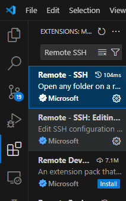
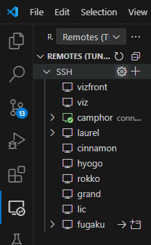
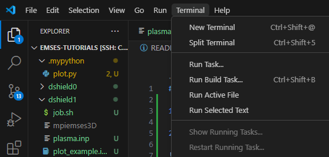
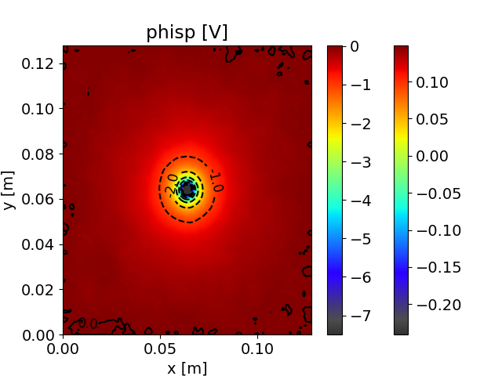
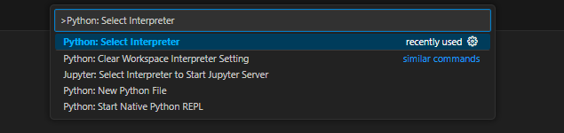
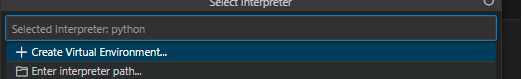
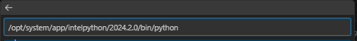

Lang: [日本語](QuickStart.md) | [English](QuickStart_en.md)

# Quick Start

Follow the steps below to get the `dshield*` tutorials running on Kyoto University’s *camphor* supercomputer.

## 1. Connect to camphor from VS Code

- Launch VS Code and install the **Remote-SSH** extension
  
- Log in to *camphor*
  
- Open a TERMINAL
  

## 2. Prepare your workspace and Python environment

```bash
mkdir -p /LARGE0/gr20001/$USER
ln -s /LARGE0/gr20001/$USER ~/large0

grep -qxF 'module load intel-python' ~/.bashrc || echo 'module load intel-python' >> ~/.bashrc
grep -qxF 'export PATH="$PATH:$HOME/.local/bin"' ~/.bashrc || echo 'export PATH="$PATH:$HOME/.local/bin"' >> ~/.bashrc

exec "$SHELL" -l

mkdir -p ~/large0/Github
cd ~/large0/Github
git clone https://github.com/CS12-Laboratory/EMSES-tutorials.git
cd EMSES-tutorials
pip install -r requirements.txt
code --reuse-window ~/large0/Github/EMSES-tutorials
```

`requirements.txt` also installs `MPIEMSES3D`, so helper commands such as `emu`, `inp2toml`, and `emses-cp` become available.

## 3. How to install MPIEMSES3D

- For normal tutorial use, `pip install -r requirements.txt` is enough.
- If you want a developer checkout, clone `MPIEMSES3D` separately and use `pip install -e .`.

```bash
cd ~/large0/Github
git clone https://github.com/CS12-Laboratory/MPIEMSES3D.git
cd MPIEMSES3D
pip install -e .
```

## 4. Copy the executable into each case

```bash
cd ~/large0/Github/EMSES-tutorials
emses-cp dshield0/
emses-cp dshield1/
emses-cp dshield2/
```

`job.sh` uses `plasma.toml` as the only runtime input. Legacy `plasma.inp.old` / `plasma.preinp.old` files are kept only as archived references.

## 5. Run `emu apply` after editing `plasma.toml`

The `dshield*` tutorials use `plasma.toml` as the primary input file. If you edit `[meta.physical]` or `[meta.unit_conversion]`, apply the conversion before submitting the job.

```bash
cd ~/large0/Github/EMSES-tutorials/dshield1
emu apply plasma.toml --dry-run
emu apply plasma.toml
```

## 6. Run `dshield0`

```bash
cd ~/large0/Github/EMSES-tutorials/dshield0
mysbatch job.sh
```

In this repository, `mysbatch` is expected to use `[mpi].nodes` from `plasma.toml`. The legacy inputs remain only as `*.old` reference files and are not part of the submission flow.

## 7. Monitor the job

```bash
qs
squeue
qgroup
latestjob
```

- Cancel a job: `scancel <job-id>`
- Standard output: `stdout.****.log`
- Standard error: `stderr.****.log`

## 8. Visualize the results

- After the batch run, `.mypython/plot.py` generates files such as `data/*.png` and `data/gif/*.gif`.
- For notebook-based visualization, open `dshield0/plot_example.ipynb`.
  Example: `phisp_2d_xy.png`
  

### Set a Python interpreter for notebooks

```bash
cd ~/large0
/usr/bin/python3.11 -m venv .venv
~/large0/.venv/bin/python -m pip install -r ~/large0/Github/EMSES-tutorials/requirements.txt
```

1. Open `Python: Select Interpreter` in VS Code
   
2. Choose `Enter Interpreter Path`
   
3. Select `~/large0/.venv/bin/python` or `/opt/system/app/intelpython/2024.2.0/bin/python`
   

References:

- [emout](https://github.com/Nkzono99/emout)
- [Sample notebook for emout](https://nbviewer.org/github/Nkzono99/examples/blob/main/examples/emout/example.ipynb)

## 9. Try different conditions

- Increase `jobcon.nstep` in `dshield0/plasma.toml` to watch a longer evolution
- Run `dshield1` and `dshield2` and compare the differences
- When visualizing `ds0` with `emout`, temporarily set `[[species]].wp` to a nonzero value if needed

For the former `advance/` examples, see [`parameter_examples`](https://github.com/CS12-Laboratory/MPIEMSES3D/tree/main/parameter_examples) in the `MPIEMSES3D` repository.

## 10. Think about the physics

- `ds0`: a negative charge in vacuum
- `ds1`: plasma with density `10^7 /cm^3` and electron temperature `3 eV`
- `ds2`: the same setup as `ds1`, but with 1/16 density

Questions to check:

- How does the potential distribution change around the charged object?
- How do electrons and ions respond?
- What changes mainly when you vary density or temperature?

## References

- [Kyoto University supercomputer manual (restricted)](http://web.kudpc.kyoto-u.ac.jp/manual-new/ja)
- [Kobe University supercomputer manual](http://www.eccse.kobe-u.ac.jp/pi-computer/)
- [MPIEMSES3D Parameters](https://github.com/CS12-Laboratory/MPIEMSES3D/blob/main/docs/Parameters.en.md)
- [MPIEMSES3D Customization](https://github.com/CS12-Laboratory/MPIEMSES3D/blob/main/docs/Customization.en.md)
