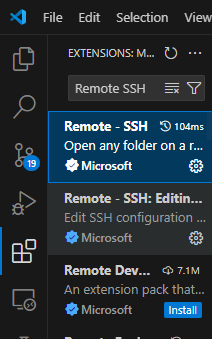
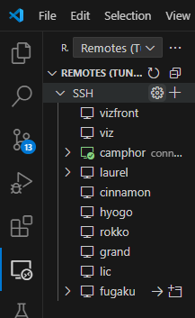
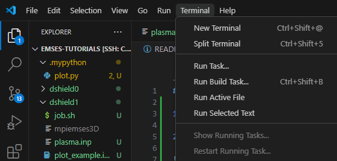
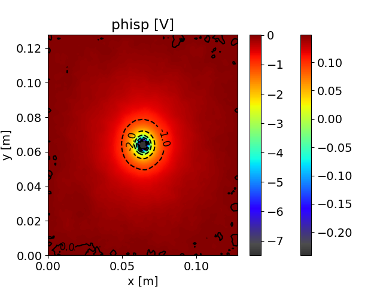
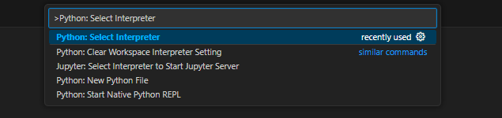
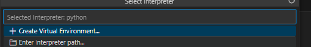
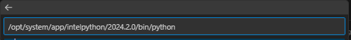

Lang: [日本語](QuickStart.md) | [English](QuickStart_en.md)

# Quick Start

This page gets your personal `EMSES-tutorials` workspace ready on Kyoto University's *camphor* supercomputer, then walks through submitting the first `dshield0` case and checking the output.

Each participant keeps their own workspace, Python environment, and expanded tutorial directory.

## Goals

- Connect to *camphor* from VS Code Remote-SSH
- Create a personal workspace under `/LARGE1/gr20001/$USER`
- Install `uv` / `uvx`, then expand tutorial files with `emses-tutorials setup`
- Install a Python venv, analysis tools, and `MPIEMSES3D`
- Run `dshield0` with `mysbatch` and inspect logs and plots

The basic workflow is:

```text
Expand files with uvx ... emses-tutorials setup
  -> check or edit plasma.toml
  -> run cpem to copy mpiemses3D into each case directory
  -> let job.sh run emu apply / lint / inspect checks
  -> submit with mysbatch job.sh
  -> inspect stdout/stderr and plots under data/
```

## 0. Before You Start

Have the following ready:

- your Kyoto University supercomputer account and SSH connection information for *camphor*
- VS Code and the **Remote - SSH** extension
- GitHub access to `CS12-Laboratory/MPIEMSES3D`
- your SSH private key and its passphrase if you set one

`MPIEMSES3D` is a private repository, so GitHub authentication may be required before the installation in Step 6.

## 1. Connect to camphor from VS Code

Launch VS Code and install the **Remote - SSH** extension.



Log in to Kyoto University's *camphor* supercomputer.



Once connected, open a TERMINAL in the remote window.



> TIP: If VS Code asks for your SSH passphrase on every connection, see [Skip the SSH passphrase prompt with `ssh-agent`](Tips_SSH_Agent_en.md). The Windows setup needs an elevated PowerShell.

## 2. Prepare Your Personal Workspace and PATH

This tutorial uses each person's own `/LARGE1/gr20001/$USER` directory.

```bash
mkdir -p /LARGE1/gr20001/$USER
if [ ! -e "$HOME/large1" ] && [ ! -L "$HOME/large1" ]; then
  ln -s /LARGE1/gr20001/$USER "$HOME/large1"
fi
mkdir -p "$HOME/large1/Github" "$HOME/.local/bin"
export PATH="$HOME/.local/bin:$PATH"
ls -ld "$HOME/large1" "$HOME/large1/Github"
```

> NOTE: `/LARGE0` was the previous default and is still usable, but it has recently been filling up and can occasionally fail to accept output files. We recommend `/LARGE1` for new work. If you use `/LARGE0`, replace the paths above with `/LARGE0/gr20001/$USER` and `~/large0`.

## 3. Prepare uv and GitHub Access

### 3-1. Install uv

Use `uvx` to run the setup command, and use the same `uv` installation for Python packages.

```bash
curl -LsSf https://astral.sh/uv/install.sh | \
  env UV_INSTALL_DIR="$HOME/.local/bin" UV_NO_MODIFY_PATH=1 sh
export PATH="$HOME/.local/bin:$PATH"
hash -r
command -v uv
command -v uvx
uvx --version
```

### 3-2. Check GitHub access to MPIEMSES3D

First check whether you can read the private repository. On success, this command exits silently.

```bash
git ls-remote https://github.com/CS12-Laboratory/MPIEMSES3D.git >/dev/null
```

If it asks for authentication or fails, log in with GitHub CLI.

<details>
<summary>Authenticate with GitHub CLI</summary>

If `gh` is not installed yet, install the latest release under your user account.

```bash
GH_VERSION=$(
  curl -fsSL https://api.github.com/repos/cli/cli/releases/latest |
  sed -n 's/.*"tag_name": "v\([^"]*\)".*/\1/p' |
  head -n 1
)
test -n "$GH_VERSION"

tmpdir=$(mktemp -d)
curl -fsSL \
  "https://github.com/cli/cli/releases/download/v${GH_VERSION}/gh_${GH_VERSION}_linux_amd64.tar.gz" \
  -o "$tmpdir/gh.tar.gz"
tar -xzf "$tmpdir/gh.tar.gz" -C "$tmpdir"
install -m 0755 "$tmpdir/gh_${GH_VERSION}_linux_amd64/bin/gh" "$HOME/.local/bin/gh"
rm -rf "$tmpdir"
gh --version
```

Log in to GitHub and connect that authentication to Git.

```bash
gh auth login --web --git-protocol https
gh auth setup-git
gh auth status
git ls-remote https://github.com/CS12-Laboratory/MPIEMSES3D.git >/dev/null
```

If the final `git ls-remote` still fails, check whether your GitHub account has access to `CS12-Laboratory/MPIEMSES3D`.

</details>

## 4. Create the Tutorial Directory and Open It in VS Code

Create the target directory first, then open it in VS Code.

```bash
mkdir -p "$HOME/large1/Github/EMSES-tutorials"
code --reuse-window "$HOME/large1/Github/EMSES-tutorials"
```

Run the following commands in the TERMINAL of the VS Code remote window you just opened.

## 5. Expand the Tutorials with the Setup Command

Do not run `git clone` manually. Instead, use `emses-tutorials setup` through `uvx` to expand the tutorial files and directories. The setup command creates `docs/`, `dshield*/`, `imgs/`, `.mypython/`, `.vscode/`, and related files, then installs `requirements.txt` into the tutorial-local `.venv/`.

```bash
cd "$HOME/large1/Github/EMSES-tutorials"
uvx --no-cache \
  --from "git+https://github.com/CS12-Laboratory/EMSES-tutorials.git@main" \
  emses-tutorials setup "$PWD" --no-extensions
```

Install the VS Code Python, Jupyter, and TOML extensions.

```bash
code --install-extension ms-python.python
code --install-extension ms-toolsai.jupyter
code --install-extension tamasfe.even-better-toml
```

After installing the extensions, open the Command Palette with `Ctrl+Shift+P`, type `reload`, and run **Developer: Reload Window**.

This workflow does not modify `~/.bashrc` to activate `.venv`. After `setup`, this repository's `.vscode/settings.json` points Python to `${workspaceFolder}/.venv/bin/python`.

Check this in a new TERMINAL:

```bash
command -v python
python -c 'import sys; print(sys.executable)'
```

If the Python path is not `.../EMSES-tutorials/.venv/bin/python`, reload the VS Code window, select `.venv/bin/python` with `Python: Select Interpreter`, and open a new TERMINAL.

## 6. Install MPIEMSES3D

The normal path is to install through pip. This builds with OpenMP enabled and also installs `mpiemses3d-tools`, which provides `emu`, `inp2toml`, `emses-cp`, and `cpem`.

```bash
cd "$HOME/large1/Github/EMSES-tutorials"
MPIEMSES3D_OPENMP=1 python -m pip install \
  "git+https://github.com/CS12-Laboratory/MPIEMSES3D.git@v4.16.6"
```

Check that the commands are visible:

```bash
command -v python
command -v mysbatch
command -v emu
command -v cpem
mpiemses3D --version
```

<details>
<summary>For developers who edit MPIEMSES3D directly (build with make)</summary>

If you plan to edit `MPIEMSES3D` itself, clone the repository and build it with `make`.

```bash
cd "$HOME/large1/Github"
git clone https://github.com/CS12-Laboratory/MPIEMSES3D.git
cd MPIEMSES3D
make OPENMP=1
python -m pip install mpiemses3d-tools==4.16.6
```

With this path, use `MPIEMSES3D/bin/mpiemses3D` as the executable to place in each case. `emu`, `inp2toml`, `emses-cp`, and `cpem` come from `mpiemses3d-tools`.

</details>

## 7. Copy the Executable into Each Case

`job.sh` runs `./mpiemses3D` inside the case directory. Use `cpem` to copy the pip-installed executable into each case.

```bash
cd "$HOME/large1/Github/EMSES-tutorials"
cpem dshield0/
cpem dshield1/
cpem dshield2/
ls -l dshield0/mpiemses3D dshield1/mpiemses3D dshield2/mpiemses3D
```

`job.sh` uses only `plasma.toml` as the runtime input. Legacy `plasma.inp` / `plasma.preinp` files are kept under each case's `.old/` directory as references.

## 8. Run dshield0

Start with the shortest check case, `dshield0`.

```bash
cd "$HOME/large1/Github/EMSES-tutorials/dshield0"
qgroup
emu apply plasma.toml --dry-run
mysbatch job.sh
```

`qgroup` shows the resource groups available to your account. If the group named by `#SBATCH -p ...` in `job.sh` is not available, ask the instructor or maintainer.

Do not run `bash job.sh` or `srun ./mpiemses3D ...` directly on the login node. `mysbatch job.sh` submits the work to compute nodes.

In this repository, `job.sh` mainly:

1. loads Camphor's Intel / Intel MPI modules;
2. activates the tutorial-local `.venv`;
3. checks that `plasma.toml` and `./mpiemses3D` exist;
4. runs `emu apply plasma.toml` to update solver-unit values;
5. runs `emu lint --mpi-size 112 plasma.toml`;
6. saves an input summary with `emu inspect plasma.toml | tee inspect.log`;
7. removes old `*_0000.h5` files;
8. runs `srun ./mpiemses3D plasma.toml`;
9. generates quick plots through `.mypython/plot.py`.

`emu apply plasma.toml --dry-run` is a preview you can run before submission. The actual update and checks run again inside `job.sh`.

## 9. Monitor the Job and Logs

```bash
qs
squeue
qgroup
latestjob
```

- Cancel a job: `scancel <job-id>`
- Standard output: `stdout.****.log`
- Standard error: `stderr.****.log`

Example log checks:

```bash
less stdout.*.log
less stderr.*.log
```

Rerunning a case writes new logs and outputs in the same case directory. Copy results you want to keep before submitting the same case again.

## 10. Visualize the Results

After the batch run, `.mypython/plot.py` generates files such as `data/*.png` and `data/gif/*.gif`.

For notebook-based visualization, open `dshield0/plot_example.ipynb`.

Example: `phisp_2d_xy.png`



### Set a Python Interpreter for Notebooks

Reuse the local `.venv` created in Step 5.

1. Open `Python: Select Interpreter` in VS Code

   
2. Choose `Enter Interpreter Path`

   
3. Select `.venv/bin/python`

   

References:

- [emout](https://github.com/Nkzono99/emout)
- [Sample notebook for emout](https://nbviewer.org/github/Nkzono99/examples/blob/main/examples/emout/example.ipynb)

## 11. Try Different Conditions

After the first run succeeds, compare cases and edit conditions:

- Run `dshield1` and `dshield2` to compare vacuum, higher-density plasma, and lower-density plasma
- Increase `jobcon.nstep` in `dshield0/plasma.toml` to watch a longer evolution
- Edit density, temperature, fixed potential, and related values under `[meta.physical]`, then inspect what `emu apply` changes
- When visualizing `ds0` with `emout`, temporarily set `[[species]].wp` to a nonzero value if needed

After editing `plasma.toml`, the basic loop is:

```bash
emu apply plasma.toml --dry-run
mysbatch job.sh
```

## 12. Think about the Physics

| Case | Physical setup |
| --- | --- |
| `dshield0` | negative charge in vacuum |
| `dshield1` | plasma with density `10^7 /cm^3` and electron temperature `3 eV` |
| `dshield2` | same as `dshield1`, but with 1/16 density |

Questions to check:

- How does the potential distribution change around the negative charge?
- How do electrons and ions respond?
- What changes mainly when density or temperature changes?

For the former `advance/` examples, see [`cookbook`](https://github.com/CS12-Laboratory/MPIEMSES3D/tree/main/cookbook) in the `MPIEMSES3D` repository.

## Common Pitfalls

See the [FAQ](FAQ_en.md) for setup diagnostics, managed file repair, and explicit overwrite updates.

- `uvx` is missing: run `export PATH="$HOME/.local/bin:$PATH"` and check whether the `uv` installation succeeded.
- `git ls-remote` or `pip install git+https://...MPIEMSES3D...` fails: check GitHub authentication and access to the private repository.
- `command -v emu` prints nothing: reload the VS Code window, select `.venv/bin/python` as the interpreter, and open a new TERMINAL. Also check whether Step 6 completed successfully.
- `mysbatch` is missing: check that `.venv` is active in a new VS Code TERMINAL, then rerun `uvx ... emses-tutorials setup ...` if needed.
- `./mpiemses3D` is missing: rerun `cpem dshield0/` or the matching case command from the tutorial root.
- Submission fails with a resource-group error: compare `qgroup` with `#SBATCH -p ...` in `job.sh`, then ask which group you should use.

## References

- [Kyoto University supercomputer manual (restricted)](http://web.kudpc.kyoto-u.ac.jp/manual-new/ja)
- [Kobe University supercomputer manual](http://www.eccse.kobe-u.ac.jp/pi-computer/)

The `MPIEMSES3D` repository is private, so the GitHub links below require repository access. If you have a local clone, the same documents live under `MPIEMSES3D/docs/`.

- Editing input files:
  - [Input parameter reference](https://github.com/CS12-Laboratory/MPIEMSES3D/blob/main/docs/Parameters.en.md) - details for `plasma.toml` / `plasma.inp` parameters, units, and namelist groups
  - [TOML `format_version = 2`](https://github.com/CS12-Laboratory/MPIEMSES3D/blob/main/docs/FormatV2.en.md) - structured TOML sections such as `[[species]]` and `[[ptcond.objects]]`
  - [`plasma.toml` customization guide](https://github.com/CS12-Laboratory/MPIEMSES3D/blob/main/docs/Customization.en.md) - `[meta.physical]`, `emu apply`, and Python-based case generation
- Checking and analyzing output:
  - [Output file reference](https://github.com/CS12-Laboratory/MPIEMSES3D/blob/main/docs/OutputFiles.en.md) - text diagnostics, HDF5 files, snapshots, and `emout` usage under `data/`
  - [Analysis guide](https://github.com/CS12-Laboratory/MPIEMSES3D/blob/main/docs/agent-analysis-guide.md) - `emout` / Python analysis, SI-unit conversion, and typical workflows
- Understanding the internals:
  - [Algorithm documentation](https://github.com/CS12-Laboratory/MPIEMSES3D/blob/main/docs/Algorithms.md) - PIC, FDTD, Poisson solver, Boris pusher, and surface interactions
  - [Architecture](https://github.com/CS12-Laboratory/MPIEMSES3D/blob/main/docs/ARCHITECTURE.md) - code organization, one-step data flow, and MPI synchronization points
  - [cookbook](https://github.com/CS12-Laboratory/MPIEMSES3D/tree/main/cookbook) - input examples and the former advanced `advance/` cases
