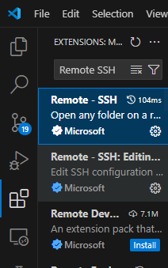
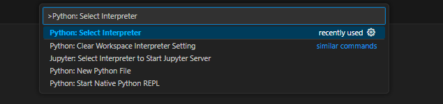

# Initial Tutorial (Running EMSES)

Follow the steps below to set up and run **EMSES** on Kyoto University’s supercomputer *camphor*.

---

## 1. Development Environment Setup

**Goal:** Connect to the supercomputer remotely from VSCode.

- Launch VSCode and install the **Remote-SSH** extension

  

- Log in to Kyoto University’s supercomputer *camphor*

  

- Open a TERMINAL

  

---

## 2. Environment Configuration and EMSES Installation

**Goal:** Secure storage space, install dependencies, and set up EMSES.

```bash
# Secure storage space
mkdir /LARGE0/gr20001/$USER
ln -s /LARGE0/gr20001/$USER ~/large0

# Add environment variables to .bashrc
grep -qxF 'module load intel-python' ~/.bashrc || echo 'module load intel-python' >> ~/.bashrc
grep -qxF 'export PATH="$PATH:$HOME/.local/bin"' ~/.bashrc || echo 'export PATH="$PATH:$HOME/.local/bin"' >> ~/.bashrc

exec $SHELL -l

# Install tutorial repository
mkdir ~/large0/Github
cd ~/large0/Github
git clone https://github.com/CS12-Laboratory/EMSES-tutorials.git
cd EMSES-tutorials
pip install -r requirements.txt # includes: git+https://github.com/CS12-Laboratory/MPIEMSES3D.git

# Open in VSCode
code --reuse-window ~/large0/Github/EMSES-tutorials
```

<details>
<summary>Details: Installing EMSES (MPIEMSES3D)</summary>

**For end-users (non-developers)**

Already included when running `pip install -r requirements.txt`:

```bash
pip install git+https://github.com/CS12-Laboratory/MPIEMSES3D.git
```

**For developers**

```bash
cd ~/large0/Github
git clone https://github.com/CS12-Laboratory/MPIEMSES3D.git
cd MPIEMSES3D
pip install -e . # runs make
```

</details>

---

## 3. Preparing Execution

**Goal:** Set up executable files and submit jobs.

* Copy executables:

```bash
emses-cp dshield0/ # = cpem dshield0/
emses-cp dshield1/
emses-cp dshield2/
```

* Test run in `dshield0` directory:

```bash
cd ~/large0/Github/EMSES-tutorials/dshield0
mysbatch job.sh
```

※ `mysbatch`: A custom command (from [camptools](https://github.com/Nkzono99/camptools)) that reads `nodes(:)` from `plasma.inp`, sets the process count in `job.sh`, and then runs `sbatch`.

---

## 4. Job Monitoring and Management

* Check job status:

  ```bash
  qs        # job status
  squeue    # job list
  qgroup    # available resources
  latestjob # tail the latest job log
  ```

* Cancel job: `scancel <job-id>`

* Standard output: `stdout.****.log`

* Standard error: `stderr.****.log`

---

## 5. Checking Job Completion

* If it does not appear in `squeue`, the job is finished.
* Check `stdout/stderr` logs.
* Verify visualization results.

---

## 6. Visualization

**Method 1:** Generate PNG/GIF with `.mypython/plot.py`
Example: `phisp_2d_xy.png`


**Method 2:** Use Jupyter Notebook (`dshield0/plot_example.ipynb`)

1. **Python interpreter setup**

   * Example using `venv`:

     ```bash
     cd ~/large0
     /usr/bin/python3.11 -m venv .venv
     # reinstall
     ~/large0/.venv/bin/python -m pip install -r ~/large0/Github/EMSES-tutorials/requirements.txt
     ~/large0/.venv/bin/python -m pip install -U emout
     ```

     Then select `~/large0/.venv/bin/python` in VSCode.

   * Or specify camphor’s Intel-Python:
     `/opt/system/app/intelpython/2024.2.0/bin/python`

   

2. **References**

   * [emout visualization library](https://github.com/Nkzono99/emout)
   * [Sample code](https://nbviewer.org/github/Nkzono99/examples/blob/main/examples/emout/example.ipynb)

---

## 7. Simulation Extensions

* **Extend runtime:**
  Change `nstep=100` in `dshield0/plasma.inp` to a larger value.

* **Run other setups:**
  Check `plasma.inp` in `dshield1` / `dshield2` and compare results.

* **Visualization and discussion:**
  Analyze outputs as with `dshield0`.

---

## 8. Predicting Results

* **ds0:** Negative charge in vacuum
* **ds1:** Plasma with density 107/cm³ and temperature 3 eV
* **ds2:** Same as ds1 but with 1/16 density

Q1. What does the potential distribution look like in ds0?
Q2. What changes occur in ds1?
Q3. How do electrons and ions behave in ds1?
Q4. How does ds2 differ?
Q5. What is the effect of changing temperature?

---

## 9. Practice Tasks

* Run and visualize `dshield0–2`.
* Compare predictions with results and analyze differences.
* **Note:** When visualizing `ds0`, `emout` does not work if `wp=0.0d0`. Set `wp=1.0d0` (or similar) in `plasma.inp`.

---

## 10. How to Study

* If execution fails, consult M1 seniors first.

* When asking your professor, include:

  1. What you asked seniors
  2. Their answers
  3. What you tried based on those answers
  4. What remains unresolved

* Minimum outputs to check: electron density (`nd1p`), ion density (`nd2p`), potential distribution (`phisp`).

* Discuss results among B4 members and share insights in the next tutorial.

---

## References

* [Kyoto Univ. Supercomputer User Manual (restricted)](http://web.kudpc.kyoto-u.ac.jp/manual-new/ja)
* [Kobe Univ. Supercomputer User Manual](http://www.eccse.kobe-u.ac.jp/pi-computer/)
* Miyake & Usui (2009), *Phys. Plasmas*, 16, 062904. [https://doi.org/10.1063/1.3147922](https://doi.org/10.1063/1.3147922)
* Miyake et al. (2019), *Multiphase Flow*, 33(3), 258–266. [https://doi.org/10.3811/jjmf.2019.T011](https://doi.org/10.3811/jjmf.2019.T011)
* Lapenta, *PIC Methods for Space Weather*, PSC Project.
  [http://fishercat.sr.unh.edu/psc/_downloads/lapenta.pdf](http://fishercat.sr.unh.edu/psc/_downloads/lapenta.pdf)
* Matsumoto, *pCANS Documentation*, Chiba Univ. CANS Project.
  [http://www.astro.phys.s.chiba-u.ac.jp/pcans/](http://www.astro.phys.s.chiba-u.ac.jp/pcans/)
* Past master’s and bachelor’s theses

---

Do you want me to also polish this into a **shorter “quick start” handout** (like one page with only the essential steps), or keep it as a **full manual style**?
