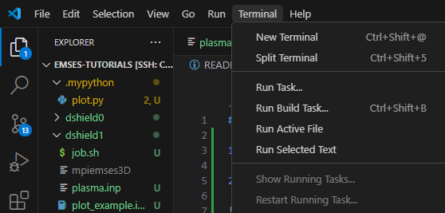
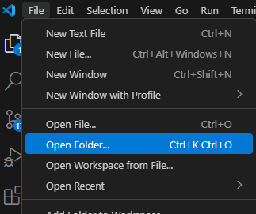
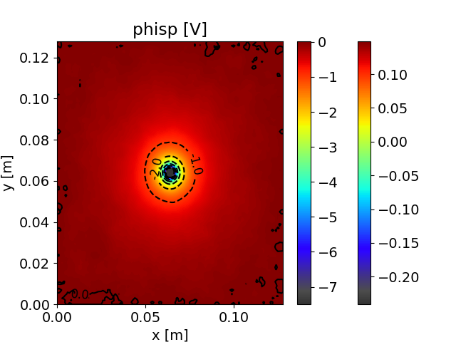
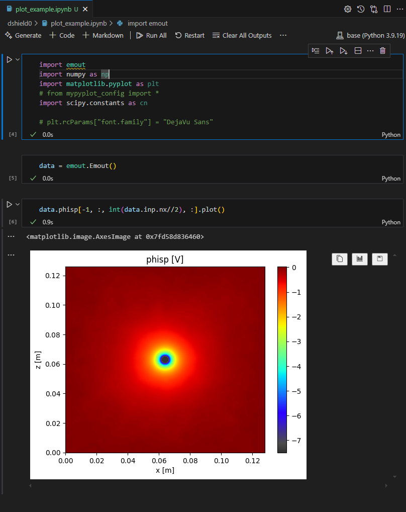

# First Tutorial

Follow the steps below to get EMSES up and running for the first time.

## 1. Launch VS Code and install the “Remote – SSH” extension


## 2. Log in to Kyoto University’s supercomputer “camphor”


## 3. Open a TERMINAL



## 4. Set up your data area: LARGE0

```bash
mkdir /LARGE0/gr20001/$USER
ln -s /LARGE0/gr20001/$USER ~/large0
````

## 4.5 Create a Python 3.11 environment

```bash
cd ~/large0
python3.11 -m venv venv
```

## 5. Edit your `.bashrc`

### 5.1 Ctrl + Left-click the path shown below


### 5.2 Add the following lines to your `.bashrc`, then log out and log back in

```bash
export PATH="$PATH:$HOME/large0/venv/bin"
export PATH="$PATH:$HOME/.local/bin"
```

## 6. After reconnecting, choose **Open Folder** → `~/large0` and re-enter your password



## 7. After reconnecting and opening a TERMINAL, install EMSES

```bash
mkdir -p ~/large0/Github
cd ~/large0/Github
git clone -b stable https://github.com/CS12-Laboratory/MPIEMSES3D.git  # We’ll use the stable high-performance version
cd MPIEMSES3D
make
```

## 8. Clone this tutorial repository and install the required Python libraries

```bash
cd ~/large0/Github
git clone https://github.com/CS12-Laboratory/EMSES-tutorials.git
cd EMSES-tutorials
pip install -r requirements.txt
```

## 9. Copy the EMSES executable into each `dshield*` directory

```bash
cp ~/large0/Github/MPIEMSES3D/bin/mpiemses3d dshield0/
cp ~/large0/Github/MPIEMSES3D/bin/mpiemses3d dshield1/
cp ~/large0/Github/MPIEMSES3D/bin/mpiemses3d dshield2/
```

## 10. Try running `dshield0`

```bash
cd ~/large0/Github/EMSES-tutorials/dshield0
mysbatch job.sh
```

```
mysbatch: Custom command (camptools: https://github.com/Nkzono99/camptools)

Reads the “nodes(:)” entry in plasma.inp, sets the number of processes in job.sh, and then runs sbatch job.sh.
```

## 11. Check the job status

```
qs         # Check job status (custom camptools command)
squeue     # Check job status (Slurm)
qgroup     # Check resource availability
latestjob  # Custom command (camptools: https://github.com/Nkzono99/camptools)
           #   Shows the latest job’s log file (= tail -n 5 stdout.*****.log)
```

> **NOTE:**
> To cancel a submitted job, run
>
> ```bash
> scancel <job-id>
> ```

> **NOTE:**
> To view the stdout & stderr of a running job:
>
> * `stdout.****.log` : standard output
> * `stderr.****.log` : standard error

## 12. Confirm the job has finished

### 12.1 Run the following; if your job ID no longer appears or its state is “FINISHED,” it has completed

```bash
squeue
```

### 12.2 Verify normal completion

* Check `stdout.*****.log` and `stderr.****.log` for errors.
* Examine the visualized results.

## 13. Visualization

### 13.1 Inspect the plots generated by the provided script (`.mypython/plot.py`)

These should be saved as `data/*.png` and `data/gif/*.gif`. For example:

`phisp_2d_xy.png`



### 13.2 Try visualizing interactively: open `dshield0/plot_example.ipynb`

See the following references for how to visualize:

* **EMSES output visualization library: [emout](https://github.com/Nkzono99/emout)**
* **Sample code:**
  [https://nbviewer.org/github/Nkzono99/examples/blob/main/examples/emout/example.ipynb](https://nbviewer.org/github/Nkzono99/examples/blob/main/examples/emout/example.ipynb)



## 14. Run for a longer time & try other simulation settings

### 14.1 Increase the runtime

In `dshield0/plasma.inp`, `nstep` is set to `100`.
This only captures the very early interaction between plasma and the object.

> **TODO:** Increase `nstep` to simulate over a longer time, then run again.

### 14.2 Run other simulation configurations

For `dshield1` and `dshield2`, open their respective `plasma.inp` files and run each one.
Compare what changes between the cases.

### 14.3 **TODO:** After each simulation finishes, visualize it just like in `dshield0` and discuss the results.

---

## Before You Look at the Results, Make Predictions

An isolated negative charge in various plasma environments:

* **ds0:** No plasma present
* **ds1:** Plasma with density 10⁷ /cm³ and electron temperature 3 eV
* **ds2:** A tenuous plasma at 1/16 the density of ds1

1. **Q1.** In ds0, what does the spatial charge‐potential distribution around the negative charge look like?
2. **Q2.** In ds1, how does the potential around the negative charge differ compared to ds0?
3. **Q3.** In ds1, how do the plasma electrons and ions behave around the negative charge?
4. **Q4.** In ds2, how does the potential around the negative charge differ compared to ds1?
5. **Q5.** If you change plasma temperature instead of density, how will the results differ?

---

## Practice Exercises

> **NOTE:**
> If you set `wp = 0.0d0` in ds0, the visualization library **emout** will not work properly.
> Therefore, when visualizing ds0, set `wp` to something like `1.0d0` in `plasma.inp` before running the visualization.

* Perform the three “Debye shielding” example runs (dshield0 – dshield2) following the steps above, then visualize each case.
* Compare your predictions (Q1 – Q5) to the actual simulation results. If your predictions differ, consider why.

> **NOTE:**
> If you run into issues following the simulation steps, first explain your situation to an M1 student and get advice. If you still can’t resolve the problem and need to ask your advisor or instructors, include all of the following information:
>
> 1. What you asked the senior student
> 2. What answer you received
> 3. What you actually did based on that answer
> 4. What still remains unresolved

After running the simulations, at minimum check:

* Electron density (`nd1p`)
* Ion density (`nd2p`)
* Potential distribution (`phisp`)

Discuss the physical meaning of these results with your B4 group members and be prepared to share your thoughts in the next tutorial.

---

## References

* [Kyoto U. Supercomputer Usage Manual (require login)](http://web.kudpc.kyoto-u.ac.jp/manual-new/ja)
* [Kobe U. Supercomputer Usage Manual](http://www.eccse.kobe-u.ac.jp/pi-computer/)
* Miyake, Y., and H. Usui, “New Electromagnetic Particle Simulation Code for the Analysis of Spacecraft-plasma Interactions,” *Phys. Plasmas*, 16, 062904 (2009). [https://doi.org/10.1063/1.3147922](https://doi.org/10.1063/1.3147922)
* 三宅洋平, 臼井英之, 桐山武士, 白川遼, 田川雅人, “宇宙機近傍プラズマ現象の数値シミュレーション,” *混相流*, Vol. 33, No. 3, 258–266 (2019). [https://doi.org/10.3811/jjmf.2019.T011](https://doi.org/10.3811/jjmf.2019.T011)
* Lapenta, G., “Particle In Cell Methods With Application to Simulations in Space Weather,” *The Plasma Simulation Code (PSC) Project*. [http://fishercat.sr.unh.edu/psc/\_downloads/lapenta.pdf](http://fishercat.sr.unh.edu/psc/_downloads/lapenta.pdf)
* 松本洋介, “pCANS ドキュメント,” *CANS プロジェクト*. [http://www.astro.phys.s.chiba-u.ac.jp/pcans/](http://www.astro.phys.s.chiba-u.ac.jp/pcans/)
* Past graduate theses and dissertations from previous students

